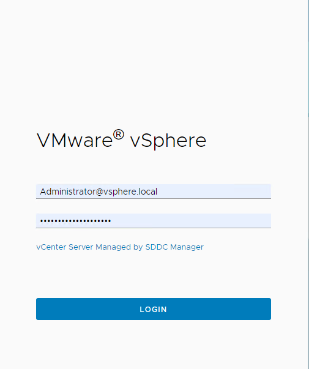
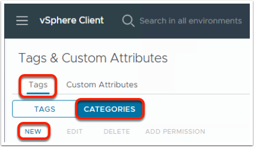
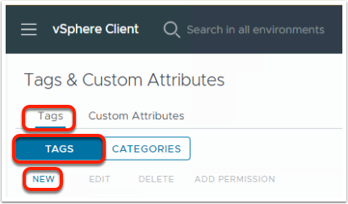
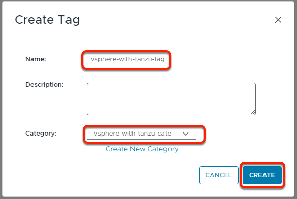
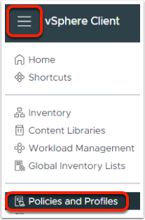
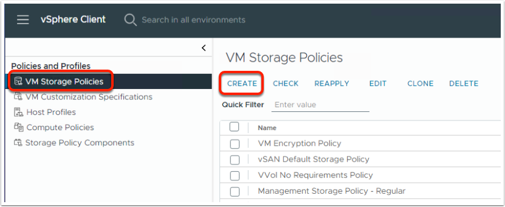
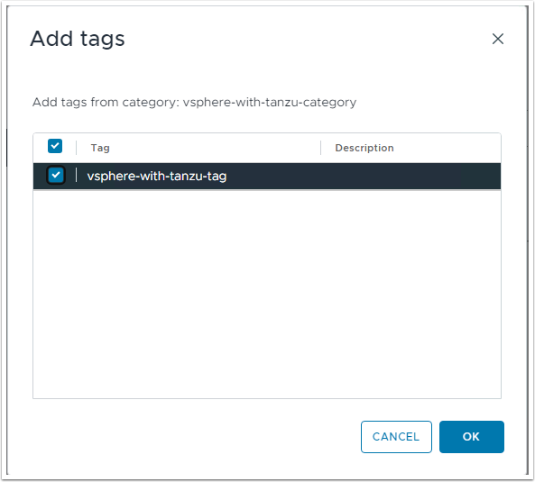

1\. Task description and objectives
-----------------------------------

Add text

2\. Create a Storage Policy
---------------------------

### 2.1. Login to vSphere client

Open Chrome

Open the Livefire Labs Bookmarkl Folder

Choose --> **MGMT WLD** --> **vCenter**

Login Using  
User:

    Administrator@vsphere.local

Click to copy

Password:

    VMware123!VMware123!

Click to copy

### 2.2. Create a Storage Policy

You need to create a storage policy before the Supervisor deployment. It is going to be used for Supervisor hosted Applications and Services.

Before creating the **storage policy**, you need to create a custom **tag** and **category,** then tag your Datastore with the new tag. The policy then uses these tags as part of it's usage rule.

When logged in the vSphere client UI:

Click on the hamburger (elipsis) menu in the top left corner

Select **Tags & Custom Attributes**

To create a new Category:

Under **Tags & Custom Attributes**,

Select **Tags**, then **CATEGORIES** --> **NEW**

In the **Create Category** wizard enter as following:

**Category Name:**

    vsphere-with-tanzu-category

Click to copy

**Tags Per Object:**

    One Tag

Click to copy

**Associable Object Types:**

    Datastore

Click to copy

Confirm with **CREATE**

You will see your Category created.

Let's continue with creating a **Tag** that is bound under this **Category**.

To create a new **Tag**:

Under **Tags & Custom Attributes**,

Select **Tags**, then again **TAGS** --> **NEW**

In the **Create Tag** wizard enter as following:

**Name:**

    vsphere-with-tanzu-tag

Click to copy

Category: vsphere-with-tanzu-category (from the drop-down)

Confirm with **CREATE**

You will see your Tag created and related to the specified Category you created earlier.

Let's continue with applying this Tag on the vSAN Datastore

Click on the hamburger (elipsis) menu in the top left corner

Select Inventory

In the Inventory menu:

Select the **Storage** section, Expand the vCenter, Expand the Datacenter

Select the **vcf-vsan** Datastore, right click on it and select **Tags & Custom Attributes**

Expand it and select **Assign Tag**

In the **Assign Tag wizard**

Select the **vsphere-with-tanzu-tag** you created earlier

Confirm with **ASSIGN**

Now you can configure a relevant **storage policy**, working with **tag based placement** of the objects, over the **vcf-vsan** Datastore.

Click on the hamburger menu in the top left corner

Select **Policies and Profiles**

Under **VM Storage Policies**

Select **VM Storage Policies** --> **CREATE**

In the **Create VM Storage Policy** wizard,

For **Name and description** enter as following:

    vsan-tanzu-storage

Click to copy

Confirm with **NEXT**

For **Policy structur**e**,** under **Datastore specific rules**,

Select **Enable tag based placement rules**

Confirm with **NEXT**

For **Tag Based Placement** **,** under **Rule 1**,

Enter the following:

    Tag category: vsphere-with-tanzu-category
    Usage option: Use storage tagged with
    Tags: vsphere-with-tanzu-tag

Click to copy

You can select the **tanzu-tag** clicking on **BROWSE TAGS**

In the **Add tags** wizzard,

Select your **vsphere-with-tanzu-tag** and confirm with **OK**

You can see and the needed values for Tag Category and Tags are in place.

Confirm with **NEXT**

For **Storage Compatibility,** under **COMPATIBLE**,

you can see the listed **vcf-vsan** Datastore.

Confirm with **NEXT**

For Review and finish you can see the configured properties in your new storage policy.

Confirm with **FINISH**
